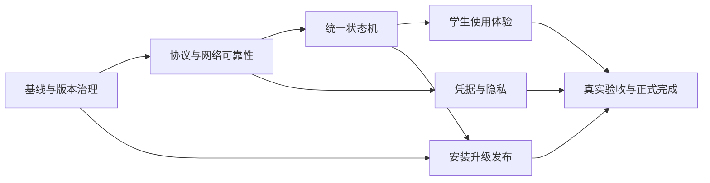

# HAUTNetworkGuard 产品完成路线图

日期：2026-09-08

基线：`v1.3.18` 本地 `main` 工作树

## 1. 目标

本路线图把“学生可以长期稳定使用”转成可执行的工程任务。产品完成的判断标准是：普通学生从下载到长期运行，不需要理解 SRUN3K、手动编辑配置或打开终端；遇到问题时能看懂状态和处理建议；开发团队能用自动化测试、真实设备记录和发布产物证明行为成立。

当前项目已经具备三平台主流程和协议契约测试，但还不能只凭本地编译宣布完成。后续每个任务都必须同时留下实现、测试、文档和验证证据。

## 2. 完成定义

### 2.1 学生主流程

以下流程全部通过，才算达到产品完成：

1. 下载正确的 Windows、macOS 或 OpenWrt 版本。
2. 安装后只填写学号和密码即可开始工作。
3. 首次登录、已在线、凭据错误、账号不存在和网关不可达都有明确提示。
4. Wi-Fi 切换、睡眠唤醒、暂时断网后能自动恢复。
5. 菜单栏、托盘或服务日志能说明当前状态、上次检测时间和下一次重试时间。
6. 关闭“记住密码”后，密码不会留在持久化存储中。
7. 重启设备后只启动一个实例，设置的自动登录行为仍然有效。
8. 更新失败可以恢复旧版本，卸载可以停止服务并按选择处理配置。

### 2.2 工程完成门槛

- 三端协议分类、加密向量和错误语义一致。
- 单元测试、契约测试、平台 smoke test 和真实设备验证均有结果记录。
- Release 资产可以独立运行，版本号、安装命令、更新说明和代码一致。
- 日志不包含密码、完整编码字段或未脱敏账号。
- 任何“成功”都必须有可复核证据：状态复读、服务进程、真实请求或安装后运行结果。

## 3. 阶段与开发任务

### M0：基线收口与版本治理

目标：让后续开发建立在唯一、可信的基线上。

| 编号 | 任务 | 平台/负责人 | 验收标准 |
|---|---|---|---|
| M0-01 | 盘点并单独提交当前工作树改动 | 共享 | 未提交改动的意图、测试结果和提交边界明确；不覆盖已有工作 |
| M0-02 | 建立当前 v1.3.18 基线快照 | 文档 | 保留历史基线原貌，同时让当前代码规模、风险和下一阶段计划有独立可信记录 |
| M0-03 | 建立单一版本源 | 共享/CI | `VERSION` 作为发布版本源；macOS、Windows、OpenWrt、README、AIREADME 和 Release 由契约测试校验 |
| M0-04 | 清理构建产物和 `.DS_Store` 风险 | 共享 | `git status` 只显示有意修改；`.gitignore` 能覆盖本地构建、日志和临时文件 |
| M0-05 | 建立验证证据目录 | 共享 | 每次发布保存 commit、资产 SHA-256、测试结果和真实设备矩阵 |

完成 M0 后，基线文档、版本号和工作树状态必须能被新开发者直接理解。

### M1：协议与网络可靠性

目标：登录和状态判断在真实校园网响应下稳定、可解释、跨平台一致。

| 编号 | 任务 | 平台/负责人 | 验收标准 |
|---|---|---|---|
| M1-01 | 扩充共享协议向量 | 共享 | 覆盖 JSONP 数字/字符串数字、空值、非法 IP、非法数值、尾随字段、错误码优先级和异常编码 |
| M1-02 | 对齐三端状态解析 | macOS/Windows/OpenWrt | 同一输入在三端得到相同的 `online/offline/unparsed` 和字段结果 |
| M1-03 | 对齐登录/注销分类 | macOS/Windows/OpenWrt | `success`、`already_online`、`logout_ok`、`not_online`、`error_E####`、`empty`、`unknown` 语义一致 |
| M1-04 | 完善请求超时、取消和并发保护 | 三端 | 状态请求不会重叠；登录/注销不会被重复点击并发触发；超时能进入可恢复状态 |
| M1-05 | 验证网络接口切换 | macOS/Windows | Wi-Fi、有线、睡眠唤醒或接口变化后能重新检测，不依赖旧接口缓存 |
| M1-06 | 建立 OpenWrt 脚本模拟测试 | OpenWrt/CI | 使用 fake `curl`、`uci`、`opkg` 和 init 脚本验证安装、升级失败和回滚路径 |

### M2：统一状态机与自动登录

目标：任何触发来源都不会造成登录循环、误报在线或手动操作被自动流程覆盖。

建议统一状态：`unknown`、`checking`、`offline`、`logging_in`、`online`、`logging_out`、`error`。

| 编号 | 任务 | 平台/负责人 | 验收标准 |
|---|---|---|---|
| M2-01 | 明确状态转移表 | 共享/三端 | [`STATE_MACHINE_CONTRACT.md`](STATE_MACHINE_CONTRACT.md) 定义状态、事件、按钮边界和日志要求 |
| M2-02 | 自动登录退避和冷却 | 三端 | 连续失败不会高频请求；成功、已在线和手动注销会正确清除或保持冷却状态 |
| M2-03 | 手动注销抑制自动重登 | 三端 | 用户主动注销后，在当前进程内暂停自动重连；只有显式手动登录才恢复，探测和网络变化不撤销该意图 |
| M2-04 | 启动与无网络场景 | 三端 | 启动时无网络不会卡死；网络恢复后能自动进入检测和登录流程 |
| M2-05 | 重启与单实例 | macOS/Windows | 开机自启只产生一个进程；前台启动和后台启动行为可区分且可验证 |
| M2-06 | 7 天稳定性测试 | 三端 | 在设定检测间隔运行 7 天，无重复实例、无限登录循环、崩溃或日志失控增长 |

### M3：学生使用体验

目标：学生不需要技术知识就能完成配置、判断状态和处理失败。

| 编号 | 任务 | 平台/负责人 | 验收标准 |
|---|---|---|---|
| M3-01 | 首次使用引导 | macOS/Windows | 解释账号、记住密码、自动登录和检测间隔；空字段和非法间隔在保存前提示 |
| M3-02 | 可理解的错误映射 | 三端 | 将常见错误码、超时、网关不可达和响应异常映射为学生可读文字，并保留技术分类 |
| M3-03 | 状态详情面板 | macOS/Windows | 显示在线/离线、IP、流量、时长、最近检测时间、最近结果和下次重试时间 |
| M3-04 | OpenWrt 可诊断输出 | OpenWrt | 日志能区分配置缺失、状态离线、登录失败、网络失败和脚本异常，不输出敏感字段 |
| M3-05 | 菜单栏/托盘生命周期 | macOS/Windows | 打开、关闭、重新打开、前后台切换、通知和退出行为稳定；UI smoke test 覆盖主链路 |
| M3-06 | 无障碍和可用性检查 | macOS/Windows | 键盘操作、焦点、按钮禁用状态、密码输入和高 DPI/深色模式通过人工检查 |

### M4：凭据与隐私

目标：把“避免明文显示”提升到合理的本地凭据保护水平。

| 编号 | 任务 | 平台/负责人 | 验收标准 |
|---|---|---|---|
| M4-01 | macOS 使用 Keychain | macOS | 记住密码写入 Keychain；关闭后删除；旧 UserDefaults 密码可安全迁移或清理 |
| M4-02 | Windows 使用 Credential Manager 或 DPAPI | Windows | 密码不再依赖固定 XOR 密钥；升级后旧配置可迁移，失败时不丢失用户名和设置 |
| M4-03 | OpenWrt 凭据边界 | OpenWrt | 配置文件权限为 600；文档明确路由器 root 用户可读取该密码的事实 |
| M4-04 | 日志隐私审计 | 共享 | 搜索和运行测试均证明密码、完整编码值、完整账号不会进入日志、错误弹窗或诊断包 |
| M4-05 | 清除和卸载语义 | 三端 | 清除配置、关闭记住密码和卸载后的残留行为有测试和用户可见说明 |

### M5：安装、升级与发布

目标：用户拿到 Release 资产即可安装，升级失败不会留下半套程序。

| 编号 | 任务 | 平台/负责人 | 验收标准 |
|---|---|---|---|
| M5-01 | Release 资产安装测试 | CI/三端 | Windows ZIP、macOS DMG 和 OpenWrt 固定版本命令均从干净环境完成安装并启动 |
| M5-02 | OpenWrt 原子安装 | OpenWrt | 每个文件先下载到临时路径，全部校验通过后再切换；失败不破坏旧版本 |
| M5-03 | OpenWrt 升级健康检查 | OpenWrt | 更新后验证文件版本、Lua 语法、服务状态和至少一轮状态请求；失败自动回滚 |
| M5-04 | 资产完整性 | CI | Release 生成 SHA-256 清单；安装文档提供对应校验方式 |
| M5-05 | macOS 签名与 Gatekeeper | macOS/CI | 构建、签名、DMG 解包和首次启动均有记录；签名失败阻止发布 |
| M5-06 | 发布说明一致性 | 共享/CI | Release 版本、下载文件名、安装命令、变更说明和实际资产自动检查 |

### M6：质量门禁与正式完成

目标：以证据宣布版本完成，而不是以“代码看起来能跑”宣布完成。

| 编号 | 任务 | 平台/负责人 | 验收标准 |
|---|---|---|---|
| M6-01 | 自动测试矩阵 | CI | Python、Lua、Windows smoke、macOS 纯逻辑和 UI smoke 按平台条件执行；失败阻止 Release |
| M6-02 | 真实校园网验收 | 三端 | 每个平台至少一台真实设备完成首次登录、断线恢复、注销、重启和错误凭据测试 |
| M6-03 | 发布前人工清单 | 共享 | 按学生主流程从下载到卸载走一遍，记录版本、设备、网络、结果和日志位置 |
| M6-04 | 运行稳定性证明 | 三端 | 7 天运行记录无崩溃、重复登录、失控重试和异常日志增长 |
| M6-05 | 版本签署 | 项目维护者 | 代码 commit、测试结果、资产哈希、发布页面和回滚方案全部归档后，才标记“产品完成” |

## 4. 依赖顺序

M0、M1 是前置基础；M2 与 M4 可以并行；M3 依赖状态机稳定；M5 必须在核心行为冻结后进行；M6 是最终门禁，不是开发阶段的替代品。

## 5. 当前项目映射

- 已有基础：三端主流程、SRUN3K 加密、JSONP/CSV 解析、请求日志、自动登录、安装/升级脚本、协议和文档契约测试。
- 正在变化：工作树已加入统一版本源消费、严格版本格式校验、OpenWrt 安装/升级/卸载事务、资产回读门禁和四端协议边界回归。
- 直接缺口：真实三端设备验证、升级后的真实状态请求、网络接口切换/睡眠唤醒、完整日志审计、跨签名升级、公证发布和长期稳定性记录。
- 当前验证范围：已确认本机为 macOS ARM64，完成匹配 SDK/编译器的构建、窗口、签名和 DMG 验证；Windows Server 2022 CI 已执行原生 CMake、DPAPI、ZIP 解压回读；Lua 5.1/5.3 已私有构建并执行安装/升级/卸载回归。校园网现场仍缺少证据，详见 `IMPLEMENTATION_LEDGER.md`。

## 6. 任务完成规则

任何任务只有同时满足以下条件才可以标记完成：

1. 代码或配置已经实现目标行为。
2. 有针对失败路径的自动化或人工测试。
3. 用户可见行为已经写入 README 或平台文档。
4. 日志、截图、命令输出、资产哈希或真实设备记录能够复核结果。
5. 没有把未执行的验证写成“通过”。

第一版产品完成建议以 M0-M3、M5-M6 为发布必需范围，M4 的平台原生凭据保护作为强烈建议的安全门禁；如果无法完成 M4，发布说明必须明确本地凭据保护边界，不能宣称“安全存储”。
